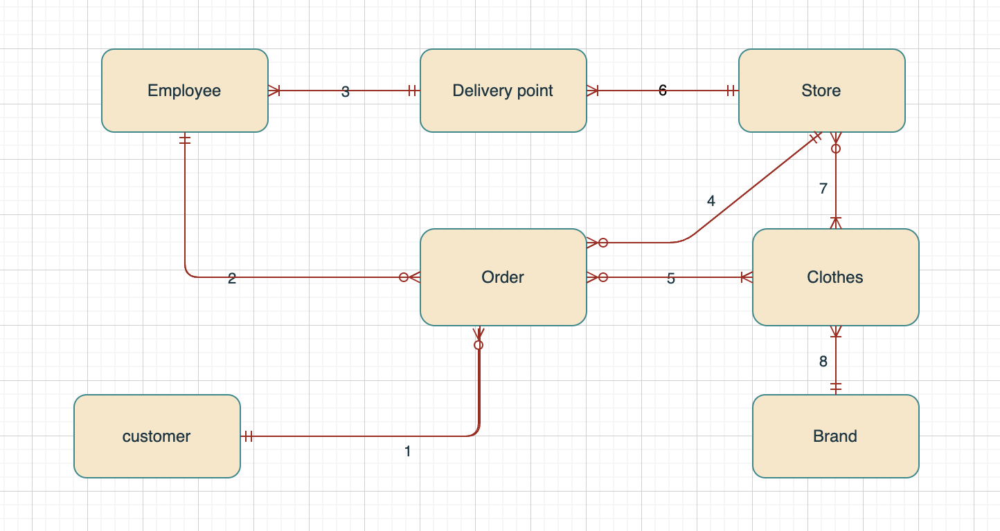
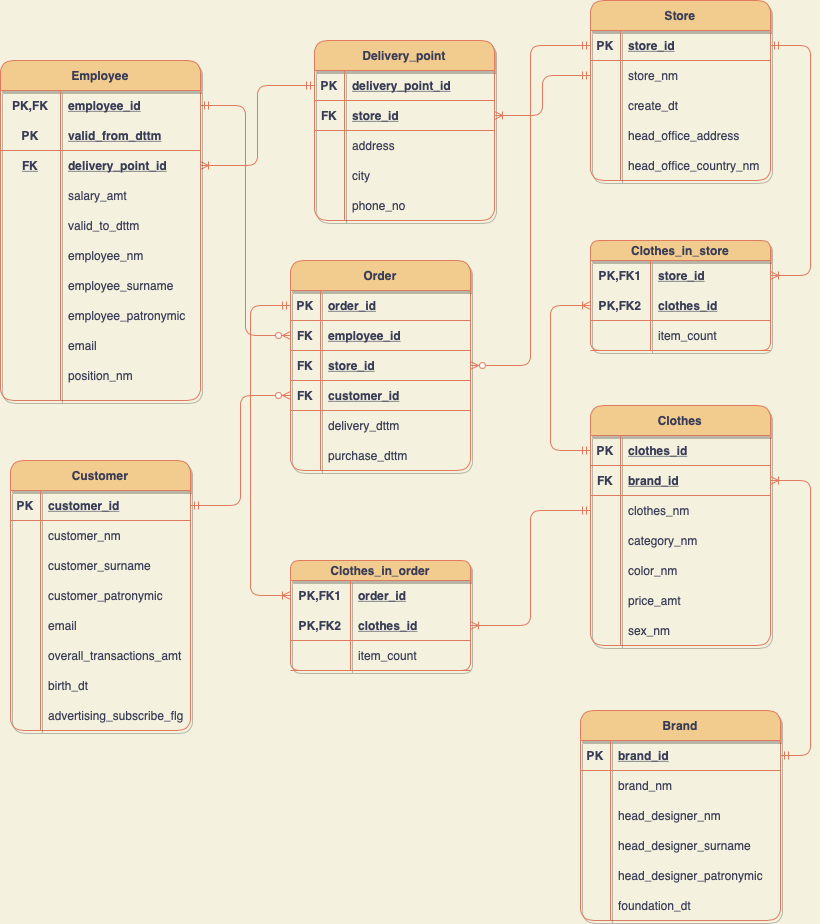

# Databases Project

Designing a database of online clothing stores.

### Conceptual model
.

Explanation of conceptual model relationships:

1) The customer can make either 0 or more orders. A particular order can only apply to one customer.
2) The employee could either not issue a single order yet, if he just got a job, or already issue at least one. A specific order could be issued only by one employee of the issuing point.
3) A specific employee can only work at one delivery point. Each delivery point can have many employees and work.
4) A particular order could only be placed in one store. In each store, of course, there are many orders, but it is possible that if the store first appeared, not a single order was placed.
5) Each order has at least one item to be considered valid. One item may appear in different orders.
6) An online store can have many delivery points, but at least one is definitely there. Each delivery point belongs to only one online store.
7) Some clothes may either not be sold anywhere, or sold at least in one store. Every store sells at least one item.
8) The brand releases at least one clothes. Each item, since it is unique, can only be sold by one brand.

### Logical model

The database is in 3rd normal form.

1 NF - since each table contains only one value for each attribute.

2NF - all attributes depend on the primary key as a whole, and not on some part of it. In those tables where there is one primary key - this is obviously done. In tables `Clothes_in_order` and `Clothes_in_store` are so because the number of things of the same `id` depends on both the `id` of the store or order and the `id` of the item. To make a versioned table consistent with the 2nd normal form, we had to move versioning into a separate
table `employee_position`, because if you leave it all in one table, then the primary
the key will already be a pair of `employee_id` and `valid_from_dttm` and then attributes such as,
for example, `employer_nm` will only depend on part of the primary key.

3NF - all attributes depend only on the primary key, but not on other attributes. Dont clear
how to prove it formally, but it seems obvious enough.

The `employee_position` table is versioned of type `SCD2`. In it for each version
position of the employee, a new line is created in which his new position and
salary with the addition of the start and end date when a particular employee worked
specific position.

.

### Physical Model

## Customer
| Title | Description | Data type | Restriction | PC | FK |
|-----------| ------------ | ------------|----------- | ------------| ------------|
| customer_id | Unique user ID | Bigserial| Not Null, Unique | + | |
| customer_nm | Real username | Varchar(40) | Not Null | | |
| customer_surname | User's real last name | Varchar(40) | Not Null | | |
| customer_patronymic | User's real middle name| Varchar(40) | | | |
| birth_dt | User date of birth | date | | | |
| email | Email address of the user | Varchar(50) | Not Null | | |
| overall_transactions_amt | The total price of purchased goods | bigint | | | |
| advertising_subscribe_flg | Flag indicating whether the user is subscribed to the promotional mailing list | Boolean | | ||

## Order
| Title | Description | Data type | Restriction | PC | FK |
|-----------| --------| ------------|----------- | ------------| ------------|
| order_id | Unique Order ID | Bigserial| Not Null, Unique | + | |
| employee_id | Unique identifier of the employee who issued the order | BigInt | Not Null,>0 | | Employee|
| store_id | The unique ID of the store where the purchase was made | BigInt | Not Null,>0 | | Store|
| customer_id | Unique identifier of the buyer who made the order| BigInt | Not Null,>0 | |Customer|
| delivery_dttm | Date and time of delivery to the point of issue of the order | timestamp | | | |
| purchase_dtm | Date and time of redemption of the order from the point of issue | timestamp | | | |

## Clothes in order
| Title | Description | Data type | Restriction | PC | FK |
|-----------| --------| ------------|----------- | ------------| ------------|
| order_id | The unique ID of the order that contains this item | Big serial | Not Null | + | Store|
| clothes_id | The unique identifier of the item that is in the order | Big serial | Not Null | + | clothes|
| item_count | The number of such things in this order | int | Not Null | | |

## Employee
| Title | Description | Data type | Restriction | PC | FK |
|-----------| --------| ------------|----------- | ------------| ------------|
| employee_id | Unique employee ID | Bigserial| Not Null, Unique | + | |
| valid_from_dttm | Date from which the position is held | timestamp | Not Null | + | |
| delivery_point_id | The unique identifier of the pickup point where the employee works| BigInt | Not Null,>0 | | Delivery Point |
| employee_nm | Employee name | Varchar(40) | Not Null | | |
| employee_surname | Employee last name | Varchar(40) | Not Null | | |
| employee_patronymic | Middle name of the employee| Varchar(40) | | | |
| valid_to_dttm | Date before which the position was held | timestamp | Not Null | | |
| birth_dt | Employee's date of birth | date | Not Null | | |
| email | Email address of the employee | Varchar(50) | Not Null | | |
| salary_amt | Employee salary | int | | | |
| position_nm | Job title | Varchar(100) | Not Null| | |

## Delivery Point
| Title | Description | Data type | Restriction | PC | FK |
|-----------| --------| ------------|----------- | ------------| ------------|
| delivery_point_id | Unique identifier of the point of issue | Big serial | Not Null, Unique | + | |
| store_id | The unique identifier of the store to which the pickup point belongs | BigInt | Not Null, >0 | | Store|
| address | Pickup point address | Varchar(40) | | | |
| city | City where the point of issue is located| Varchar(40) | | | |
| phone_no | Phone number of delivery point | int | | | |

## Store
| Title | Description | Data type | Restriction | PC | FK |
|-----------| ------------ | ------------|----------- | ------------| ------------|
| store_id | Shop Unique ID | Bigserial| Not Null, Unique | + | |
| store_nm | Store name | Varchar(60) | Not Null | | |
| create_dt | Store creation date | date | | | |
| head_office_address | Address where the main office is located | Varchar(40) | | | |
| head_office_country_nm | Country where head office is located| Varchar(40) | | | |

## Clothes in store
| Title | Description | Data type | Restriction | PC | FK |
|-----------| --------| ------------|----------- | ------------| ------------|
| store_id | The unique ID of the store that has this item | Big serial | Not Null | + | Store|
| clothes_id | The unique identifier of the item that is in the store | Big serial | Not Null | + | clothes|
| item_count | The number of such things in this store | int | Not Null | | |

## Clothes
| Title | Description | Data type | Restriction | PC | FK |
|-----------| --------| ------------|----------- | ------------| ------------|
| clothes_id | Item Unique Identifier| Bigserial| Not Null, Unique | + | |
| brand_id | The unique identifier for the brand that released this item| BigInt | Not Null,>0 | | Brand|
| clothes_nm | Item name | Varchar(100) | Not Null | | |
| category_nm | Category of clothing to which the item belongs | Varchar(40) | Not Null | | |
| color_nm | Item color name| Varchar(40) | | | |
| price_amt | Cost | int | Not Null | | |
| sex_nm | The sex for which it was made | Varchar(50) | | | |

## Brand
| Title | Description | Data type | Restriction | PC | FK |
|-----------| ------------ | ------------|----------- | ------------| ------------|
| brand_id | Brand Unique Identifier | Bigserial| Not Null, Unique | + | |
| brand_nm | Brand name | Varchar(40) | Not Null | | |
| head_designer_nm | Name of chief designer| Varchar(40) | Not Null | | |
| head_designer_surname | Surname of the chief designer| Varchar(40) |Not Null | | |
| head_designer_patronymic | Middle name of the chief designer| Varchar(40) | | | |
| foundation_dt | Brand foundation date | Date | | | |

